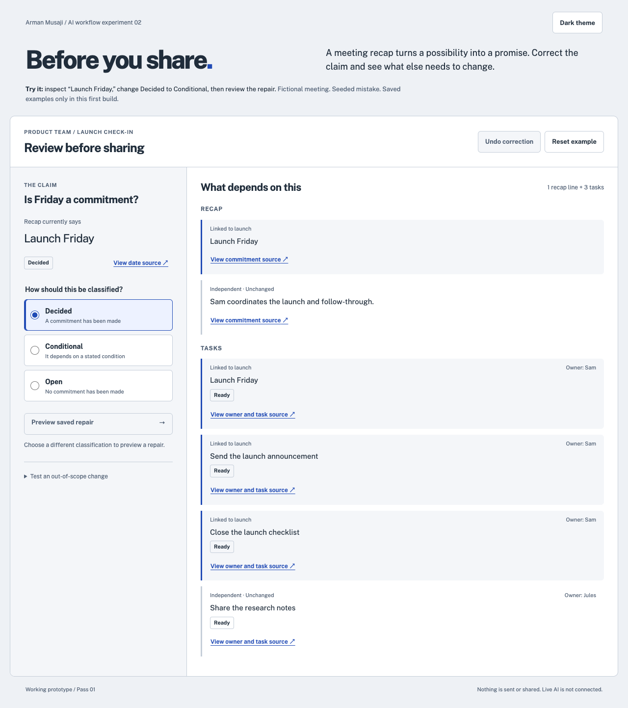
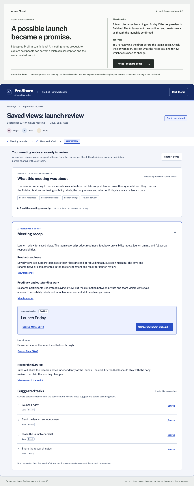
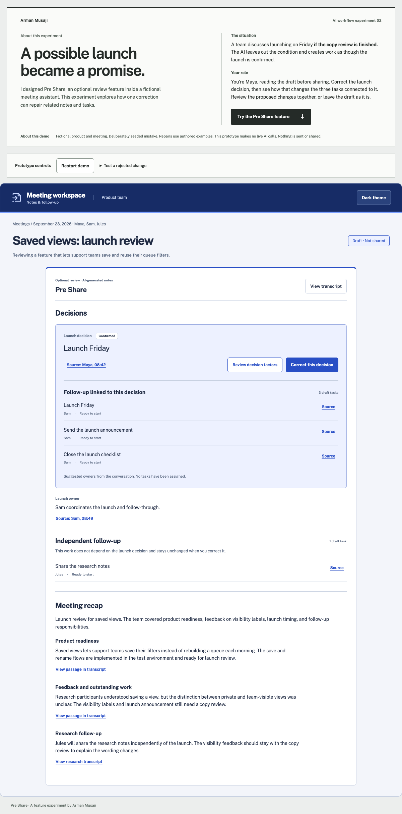

# Build history: eleven versions

[Back to the prototype](https://pre-share.vercel.app)

**Short version:** the working logic arrived early. Most of the eleven versions went into figuring out what the product is, who is using it, and what it should never ask of them.

**Pass 1.** Controls and logic, 18 tests passing, and no product around them. Arman couldn't tell what he was looking at, and it felt too close to project one.

**Pass 5.** Now it's a meeting tool, but branded as a product ("PreShare"), the review is framed as a chore, the decision is buried under the recap, and the tasks sit far below it. Decorative labels look like buttons and an icon looks like a menu.

**Pass 11.** A feature inside a plain meeting workspace. The decision and its three tasks come first, and the untouched work sits right below.

## What changed, pass by pass
| Pass | What changed | Who caught the problem |
|---|---|---|
| 1 | First working flow | Arman: confusing, too similar to project one |
| 2 | Wrapped in a meeting-notes product | Arman |
| 3 | Meeting grew from 3 lines to 12 | Arman: too thin to believe |
| 4 | Visitor introduction added | Arman |
| 5 | Branding moved from the intro to the product | Arman: wrong layer |
| 6 | Looking at the evidence and correcting became separate | Arman: the person was doing the note-taker's job |
| 7 | Decision and its tasks shown together | Research plus Arman |
| 8 | Clear Decisions heading, fake buttons removed | Arman |
| 9 | Real "View transcript" button instead of a menu-like icon | Arman |
| 10 | Decisions first, planted-mistake fixes, demo controls moved out | Claude's review |
| 11 | Task sources show both lines they depend on | Claude's recheck |
